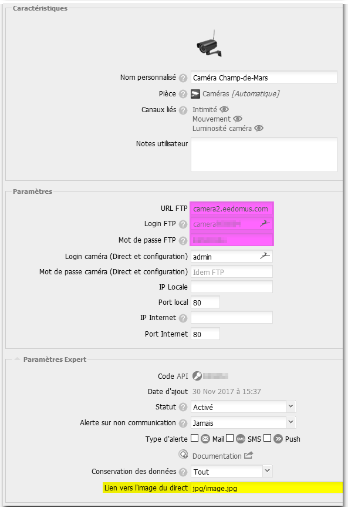
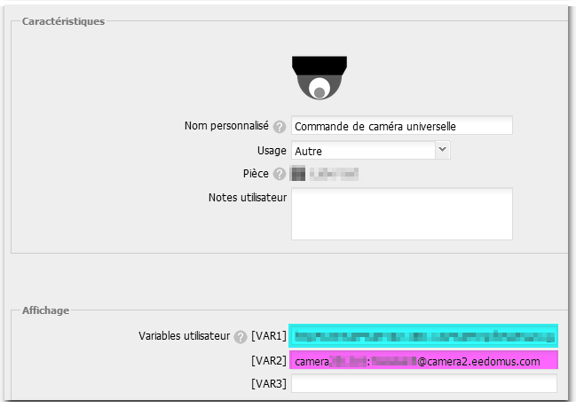
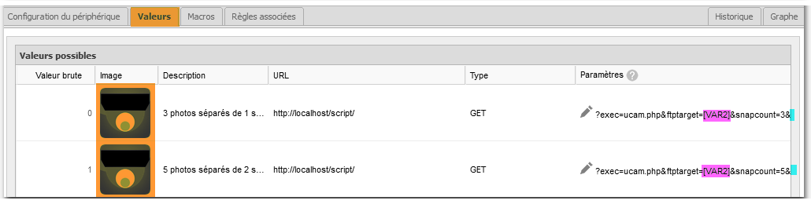

# eedomus script : uCam

* Plugin version : 1.1
* Origine : [GitHub/Nikya/uCam](https://github.com/Nikya/eedomusScript_ucam "Origine sur GitHub")

## Description
**Nikya eedomus Script _Universal Camera_** (uCam) est un plugin pour la box domotique eedomus, qui permet de piloter **certaines caméras** IP.

- Ce plug-in se veut **universel**, car il peut fonctionner avec toutes les caméras IP qui fournissent des URL de pilotage.
- En contre-partie, c'est à vous de **trouver et fournir** à ce plugin les URL nécessaires. Il est possible de la trouver :
    - Dans la documentation de votre caméra
    - Sur le site suivant [iSpyConnect](https://www.ispyconnect.com/sources.aspx)
    - Sur le forum de ce plugin : [forum eedomus](http://forum.eedomus.com/viewtopic.php?f=50&t=6210)

Son utilité peut être par exemple d'enregistrer une série de photo
- Lorsque quelqu'un sonne chez vous
- Quand une intrusion est détectée

## Fonctionnalités

### Snapshot

#### Côté caméra
Sur l'appel d'une URL particulière, fournis un instantané de ce que voit la caméra sous forme d'une photo.

#### Côté plugin
Consiste à demander cet instantané puis de le sauvegarder ensuite via un FTP choisit.  
Il est possible de déclencher une série de plusieurs photos en choisissant :
* le nombre de photos à traiter
* Un temps d'attente entre chaque photo

### Preset

***EN COURS DE DÉVELOPPEMENT***  

#### Côté caméra
Sur certaines caméras motorisées, il est posssible de préenregistrer des positions.  
Ces positions sont appelées ***preset***.  

#### Côté plugin
Donne la possibilité d'appeler un _preset_ particulier avant de demander le déclenchement des _snapshot_

## Prérequis

### 1
Posséder une caméra IP qui fournit des URL de pilotage et les connaitres.

### 2
Installer une caméra côté eedomus.  
Depuis le portail _eedomus_ sélectionner :
- `Configuration`
- `Ajouter ou supprimer un périphérique`
- `Caméras IP` > `Ajouter un autre type de caméra`
- `Camera - Autre`

Ce genre de périphérique va vous fournir une _caméra virtuelle_, reliée à un FTP eedomus.  
Son principe est que chaque photo envoyée sur le FTP de cette caméra mettra à jour son visuel.  
En complément vous pouvez également fournir l'URL du flux en direct de la caméra, si vous la connaissez, dans `Paramètres Expert` > `Liens vers l'image du direct`  

A cette étape, vous devez également noter les informations de FTP à réutiliser ultérieurement (URL, Login, Mot de passe).

## Installation via store

Depuis le portail _eedomus_, cliquez sur
- `Configuration`
- `Ajouter ou supprimer un périphérique`
- `Store eedomus`
- puis sélectionner _uCam - Camera universelle_

Des informations seront demandées pour la création du plugin :

- **URL de Snap** : URL complète pour obtenir un snap de la caméra. **Attention** Cette URL doit être encodée [URL encode](https://www.google.fr/search?q=url+encode+online&ie=utf-8&oe=utf-8&client=firefox-b-ab&gfe_rd=cr&dcr=0&ei=Qd0fWq3DCen-8AfprbvYDA)

- **FTP** : Les informations du FTP qui recevra le _snapshot_ (FTP eedomus fournis à l'étape précédente _Prerequis #2_)
    - Le login
    - Le mot de passe
    - Le serveur (URL)
    - Le tout en une seule entrée au format : `login:passe@serveur`
    - Peut également être encodé s'il comporte des cratères trop spéciaux

Après cette étape un nouveau périphérique _Caméra universelle_ sera disponible avec
- VAR1 : URL de Snapshot
- VAR2 : Information de FTP
- de base 2 valeurs de pilotage en exemple :
    - 3 photos séparées de 1 seconde
    - 5 photos séparées de 2 secondes

Vous pouvez ensuite adapter selon vos besoins (Voir § _Les fonctions du script_)

## Installation manuelle

1. Télécharger le projet sur GitHub : [GitHub/Nikya/ucam](https://github.com/Nikya/eedomusScript_ucam "Origine sur GitHub")
1. Uploader le fichier `dist/ucam.php` sur la box ([Doc eedomus scripts](http://doc.eedomus.com/view/Scripts#Script_HTTP_sur_la_box_eedomus))
2. Créer manuellement le périphérique _uCam_.

## Les fonctions du script

### Execution du script :

* Format : https://[ip_box_eedomus]/script/?exec=ucam.php&[params]
* Exemple : https://192.168.1.60/script/?exec=ucam.php&ftptarget=[VAR2]&snapcount=3&snapinterval=1&urlsnap=[VAR1]

### Paramètres

- **ftptarget** : Informations du FTP cible au format `user:password@server`
- **snapcount** : Nombre de photos à sauvegarder. Optionnel, valeur par défaut 1
- **snapinterval** : Temps d'attente, en seconde, entre chaque photo. Optionnel, valeur par défaut 1.

### Résultat

1. Le script répond avec un résumé des actions exécutées.
    * **Nota** : Le temps de réponse du script sera proportionnel à la valeur `snapcount` x `snapinterval`
* L'aperçu de la caméra virtuelle est mis à jour avec la dernière photo envoyé au FTP
* L'historique d'image comporte la série de photo enregistrée par ce script

## Résumé en image

